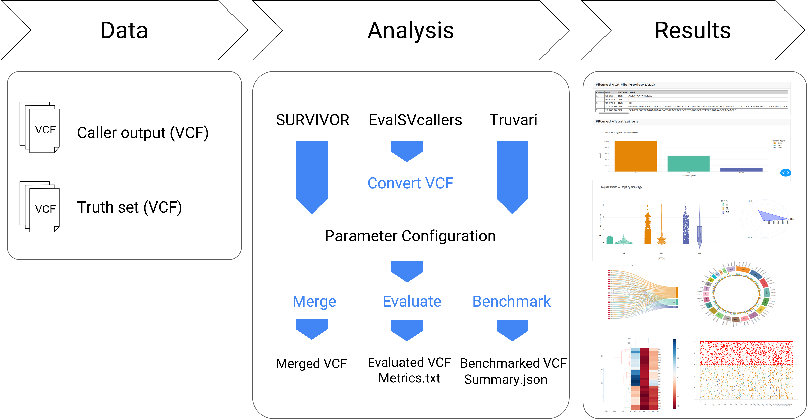
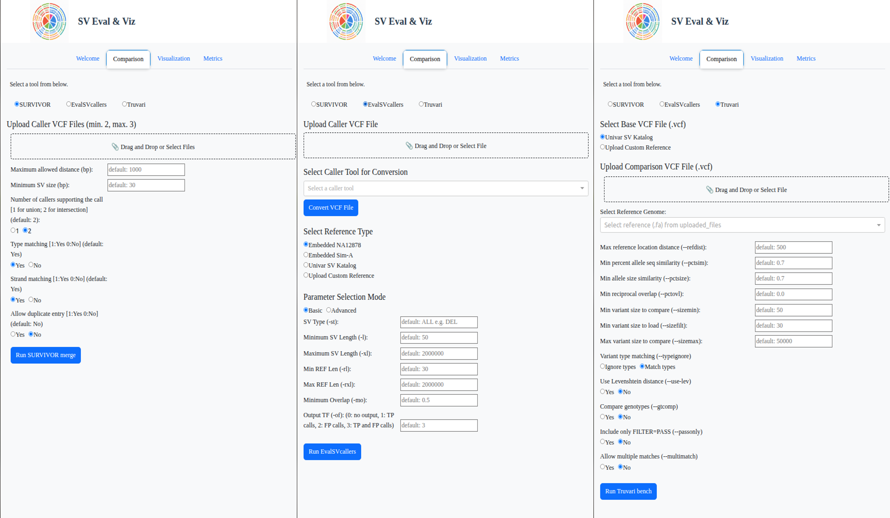
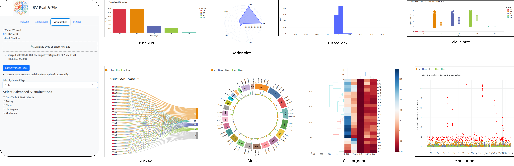
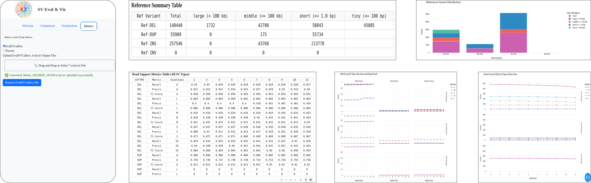

# SV Evaluation & Visualization Web Tool (SV-EViz)

SV comparison/benchmarking and visualization web tool.  
Built with Dash, integrates **SURVIVOR (merge)**, **EvalSVcallers (evaluate)**, **Truvari (bench)**, and rich interactive plots.

Structural variant benchmarking requires multiple command-line tools, fragmented workflows, and extensive technical expertise. 
Although tools such as SURVIVOR, Truvari, and EvalSVCallers are widely used, they operate independently and lack an integrated, user-friendly interface.

SV-EViz addresses this gap by providing:

- A unified web-based environment
- Standardized input handling
- Consistent comparison logic
- Interactive and reproducible visualizations

## Key Features

- Web-based interface (no command-line required)
- Support for multiple SV comparison and consensus generation frameworks:
  - SURVIVOR merge
  - Truvari bench
  - EvalSVCallers evaluate
- Unified preprocessing and filtering pipeline
- Interactive visualizations:
  - SVTYPE distributions
  - SV length distributions
  - Manhattan plots
  - Clustergrams
  - Circos plots
  - Sankey diagrams
- Parameter sensitivity analysis (default parameter configurations are pre-defined and automatically loaded, while allowing users to modify all parameters)
- Reproducible benchmarking workflows
- Modular and extensible architecture

## Supported Inputs

- VCF files from SV callers (e.g., Manta, Delly, GRIDSS)
- SURVIVOR merged VCF outputs
- Truvari bench VCF outputs
- EvalSVCallers evaluation outputs (.eval.txt)
- Reference truth sets VCF (e.g., GIAB)

## Outputs

- Benchmarking metrics (Precision, Recall, F1-score)
- SV-level classification (TP / FP / FN)
- Publication-ready downloadable figures and tables


<p align="center">
  
</p>


<p align="center">
  
</p>  

## Visualization Modules

- SVTYPE count distributions
- SV length distributions by chromosome
- Manhattan plots for genome-wide SV distribution
- Clustergram for chromosome-SVTYPE relationships
- Circos plots for genome-wide SV density
- Sankey diagrams for caller–SVTYPE–chromosome relationships


<p align="center">
  
</p>  


<p align="center">
  
</p>

## Installation (Docker)

```bash
docker pull maden21/sv-eviz
docker run -p 8040:8040 sveviz/sveviz
```
### Installation (Manuel):
```markdown
git clone https://github.com/gamzemdn/SV-EViz-web-tool.git
cd SV-EViz
pip install -r requirements.txt
python app.py
```
## Case Study
SV-EViz was evaluated using Manta output of the HG00514 sample, with the UniVar SV catalog used as the reference dataset. The figures presented here belong to this case study.

---

## Citations for Tools Used in This Framework
SV-EViz was evaluated using Manta output of the HG00514 sample, with the UniVar SV catalog used as the reference dataset. The figures presented here belong to this case study.

- **SURVIVOR** – A tool for merging, comparing, simulating, and evaluating structural variants.  
  Jeffares, D.C., Jolly, C., Hoti, M., Speed, D., Shaw, L., Rallis, C., Balloux, F., Dessimoz, C., Bähler, J., & Sedlazeck, F.J. (2017).  
  *Transient structural variations have strong effects on quantitative traits and reproductive isolation in fission yeast*.  
  **Nature Communications**, 8, 14061, 1–11. [https://doi.org/10.1038/ncomms14061](https://doi.org/10.1038/ncomms14061)  
  GitHub: [fritzsedlazeck/SURVIVOR](https://github.com/fritzsedlazeck/SURVIVOR)

- **EvalSVcallers** – A benchmarking framework for evaluating structural variant calling algorithms.  
  Kosugi, S., Momozawa, Y., Liu, X., Terao, C., Kubo, M., & Kamatani, Y. (2019).  
  *Comprehensive evaluation of structural variation detection algorithms for whole genome sequencing*.  
  **Genome Biology**, 20(1), 117. [https://doi.org/10.1186/s13059-019-1720-5](https://doi.org/10.1186/s13059-019-1720-5)  
  GitHub: [stat-lab/EvalSVcallers](https://github.com/stat-lab/EvalSVcallers)

- **Truvari** – A refined comparison tool that evaluates structural variant calls while preserving allelic diversity.  
  English, A.C., Menon, V.K., Gibbs, R.A., et al. (2022).  
  *Truvari: refined structural variant comparison preserves allelic diversity*.  
  **Genome Biology**, 23, 271. [https://doi.org/10.1186/s13059-022-02840-6](https://doi.org/10.1186/s13059-022-02840-6)  
  GitHub: [ACEnglish/truvari](https://github.com/ACEnglish/truvari)
